```{r, echo=FALSE}
library(metathis)
meta() %>% 
  meta_description(params$event) %>% 
  meta_name("github-repo" = paste0("datactivist/", params$slug)) %>% 
  meta_viewport() %>% 
  meta_social(
    title = params$title,
    url = paste0("https://datactivist.coop/", params$slug),
    image = params$image,
    image_alt = params$image_alt,
    og_type = "website",
    og_author = "Datactivist",
    og_locale = "fr_FR",
    og_site_name = "Datactivist",
    twitter_card_type = "summary",
    twitter_creator = "@datactivi_st")

```

layout: true

<style>
.remark-slide-number {
  position: inherit;
}

.remark-slide-number .progress-bar-container {
  position: absolute;
  bottom: 0;
  height: 4px;
  display: block;
  left: 0;
  right: 0;
}

.remark-slide-number .progress-bar {
  height: 100%;
  background-color: #e95459;
}

</style>


`r paste0("<div class='my-footer'><span>", params$event, "</span> <center><div class=logo><a href='https://datactivist.coop/'></a></div></center></span></div>")` 


---

class: center, middle

Ces slides en ligne : `r paste0("http://datactivist.coop/", params$slug)`

Sources : `r paste0("https://github.com/datactivist/", params$slug)`


Les productions de Datactivist sont librement réutilisables selon les termes de la licence [Creative Commons 4.0 BY-SA](https://creativecommons.org/licenses/by-sa/4.0/legalcode.fr).

<BR>
<BR>


---
background-image: url("img/background.png")

### Un atelier dans le cadre de numérique en commun[s]

Organisé par : 
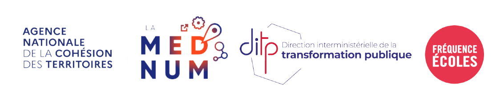
En partenariat avec le Conseil National du Numérique : 

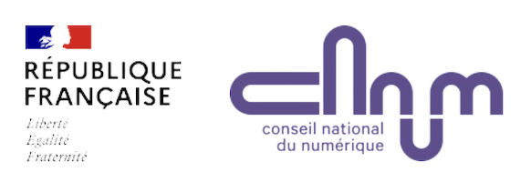]

---
### Petit tour de table


<iframe width="560" height="315" src="https://www.youtube.com/embed/t_Bb4PfLvJE" title="YouTube video player" frameborder="0" allow="accelerometer; autoplay; clipboard-write; encrypted-media; gyroscope; picture-in-picture" allowfullscreen></iframe>


### .red[30 secondes maximum par personne]

---
### L'open data des territoires, où en est-on ?

.reduite.center[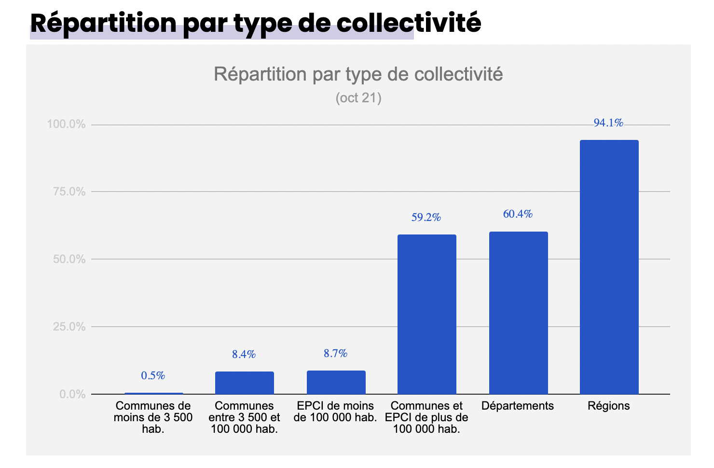]

---
### Les données territoriales, un potentiel à renforcer

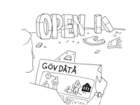

* Chaque territoire publie les données selon ses compétences mais aussi son patrimoine de données accessible. 

* Les données ne sont pas nommées pareil selon les territoires, **difficile de savoir qui produit quoi.**  

* Surtout, les fichiers ne contiennent pas les mêmes champs et ne donnent pas le même niveau d'information. Les valeurs dans les champs eux-mêmes ne sont pas normalisées.

En conséquence, il est très compliqué de **construire des usages** qui dépassent un seul territoire. **L'impact des données territoriales reste limité**.

---

### La standardisation pour créer des infrastructures de données 

Pour démultiplier l'impact des données territoriales, nous avons besoin .red[**à terme**] de créer des infrastructures de données. 

Quelques caractériques d'une infrastructure : 
* **Son encastrement** : comme « coulée » à l’intérieur d’autres structures

* **Sa transparence** : un soutien invisible des tâches de l'usager

* **Sa portée** : au-delà d’un événement isolé ou d’une pratique unique

* **Sa base installée** : l’infrastructure ne vient pas de rien ; elle lutte contre l’inertie de la base installée et hérite des forces et limites de cette base. 

* **Sa visibilité au moment d’une défaillance**  : une infrastructure devient visible quand elle est défaillante

.footnote[Source : Star & Ruhleder (1997), « Vers une écologie de l'infrastructure »,[10.3917/rac.009.0114](https://www.cairn.info/revue-anthropologie-des-connaissances-2010-1-page-114.htm)]

---
### Quelques définitions

.pull-left[
* **Un standard** : "un ensemble de recommandations développées et préconisées par un groupe représentatif d’utilisateurs" ([Wikipedia](https://fr.wikipedia.org/wiki/Standard))

* **Une norme** : selon l'ISO, un document "établi par un consensus et approuvé par un organisme reconnu", qui établit des "lignes directrices ou des caractéristiques" ([Wikipedia](https://fr.wikipedia.org/wiki/Standard))
]

.pull-right[
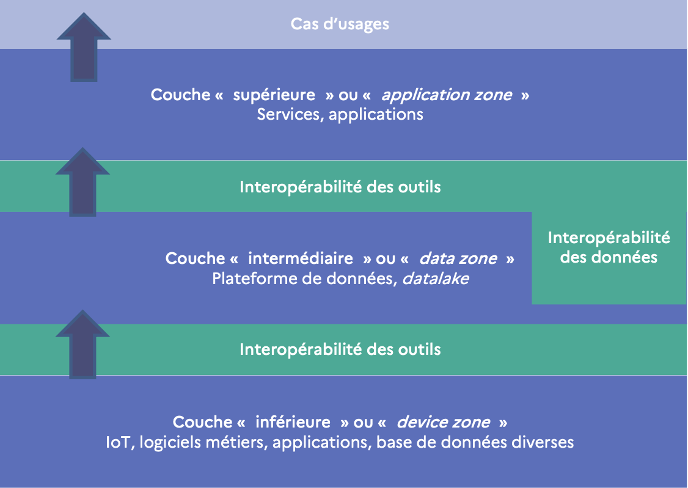
]

* **L'Interopérabilité** : "la capacité de deux ou plusieurs réseaux, systèmes, outils, applications ou composants d’échanger facilement des informations de manière sécurisée et efficiente sans gêner l’utilisateur". C'est ce qui permet à différents outils numériques de communiquer pour construire un ensemble cohérent au service d’un ou plusieurs objectifs. 

---
### Les schémas de données

.pull-left[
Les schémas de données décrivent des **modèles de données** : quels sont les différents champs, comment sont représentées les données, quelles sont les valeurs possibles etc.


Les schémas permettent de **valider** qu'un jeu de données se conforme à un schéma, de **générer** de la documentation automatiquement, de générer des données ou de proposer des formulaires standardisés.

Véritables gabarits, ils permettent  **une montée en qualité des données proposées en open data**, surtout lorsque plusieurs producteurs produisent un même jeu de données.
]

.pull-right[

.footnote[Texte et illustration : [schema.data.gouv.fr](https://schema.data.gouv.fr/)]
]

---
class:inverse
### Focus sur [schema.data.gouv.fr](https://schema.data.gouv.fr/)

.pull-left[
* Une initiative d’Etalab (DINUM) de référencement des schémas de données publiques pour la France.

* Référence les standards co-construits avec descommunautés d’usagers et validés mais également des schémas en cours d’investigation et de construction.

* Propose des guides pour créer des schémas de données et de la documentation très complète.
]

.pull-right[
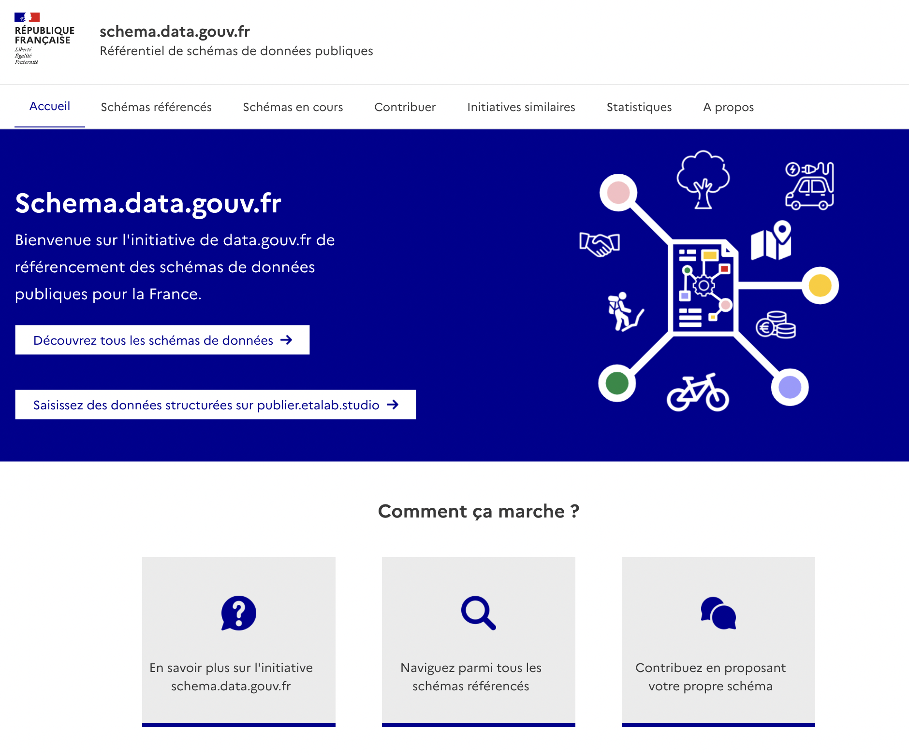
]

---
### Un schéma de données : à quoi ça ressemble ? (1/2)

Voici un exemple de schéma suivant la spécification Table Schema, le schéma lui-même suit un standard. Son contenu commence par une description normalisée du schéma : 

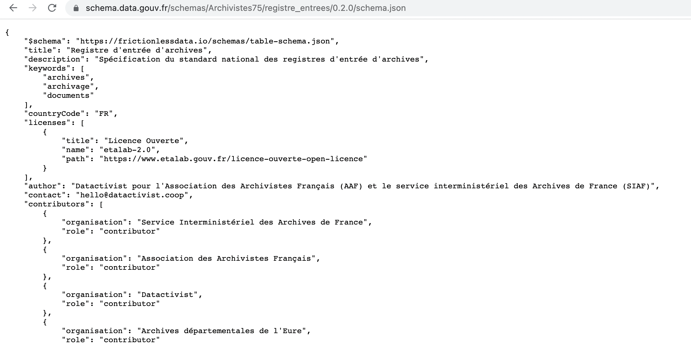


---
### Un schéma de données : à quoi ça ressemble ? (2/2)

S'en suit ensuite une description normalisée des champs : 

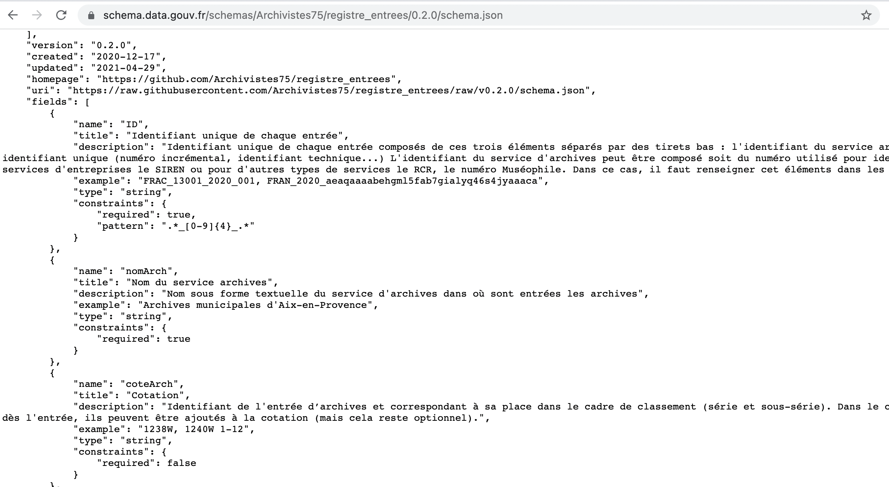

---
### Les schémas référencés sur data.gouv.fr
.pull-left[
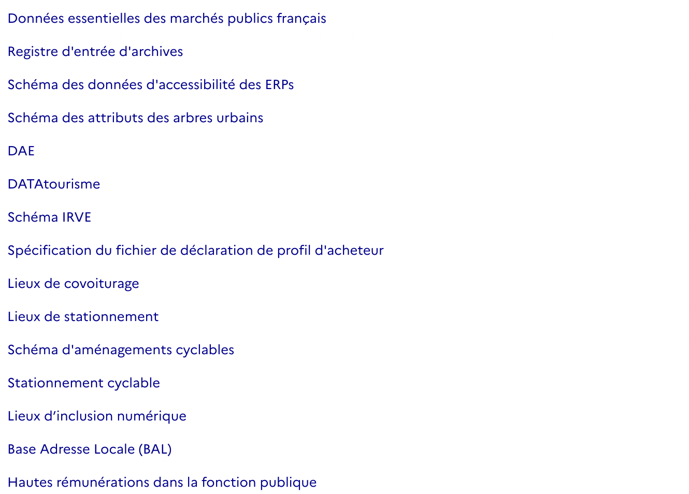
]

.pull-right[
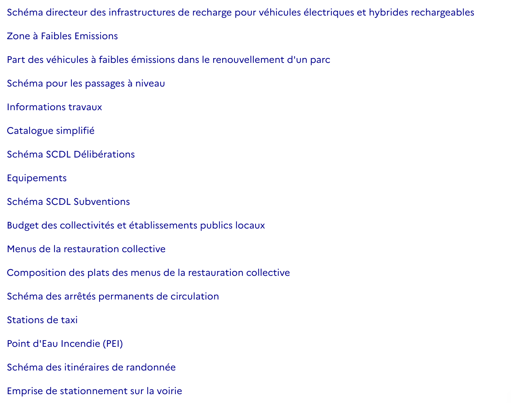
]
---

class:inverse
### Focus sur le [Socle Commun de Données Locales (SCDL)](https://scdl.opendatafrance.net/docs/)

.pull-left[

Une initiative de l'association Open Data France qui vise à homogénéiser la publication en open data de données essentielles produites par des acteurs territoriaux (collectivités locales ou partenaires).

Elle porte sur des jeux de données préalablement sélectionnés comme prioritaires afin de : 


]

.pull-right[
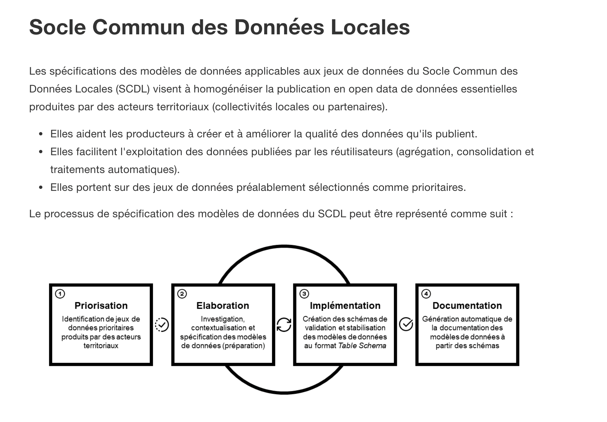
]


* Aider les producteurs à créer et à améliorer la qualité des données qu'ils publient.
* Faciliter  l'exploitation des données publiées par les réutilisateurs (agrégation, consolidation et traitements automatiques).

---
class:inverse
### Focus sur [Validata](https://validata.fr/doku.php)

.pull-left[
Validata est une plateforme de validation de données ouvertes produites par des acteurs territoriaux. Elle offre à ses utilisateurs la possibilité de vérifier la conformité de ces données par rapport aux modèles définis dans le cadre du Socle Commun des Données Locales (SCDL).

En détectant d'éventuelles erreurs ou anomalies, en amont ou en aval de leur publication, elle aide à harmoniser les données locales ouvertes, elle engage à améliorer leur qualité et elle facilite leur exploitation par les réutilisateurs.
]

.pull-right[

[](https://validata.etalab.studio/table-schema?input=url&url=https%3A%2F%2Fraw.githubusercontent.com%2Fetalab%2Ftransport-base-nationale-covoiturage%2Fmain%2Fbnlc-.csv&schema_name=schema-datagouvfr.etalab%2Fschema-lieux-covoiturage)
[Fichier source](https://www.data.gouv.fr/fr/datasets/base-nationale-des-lieux-de-covoiturage/)
]

---
class:inverse, middle, center

## La standardisation des données, ailleurs
## .red[Quelques exemples internationaux]


---
### [General Transit Feed Specification (GTFS)](https://developers.google.com/transit/gtfs/reference?hl=fr)

.pull-left[
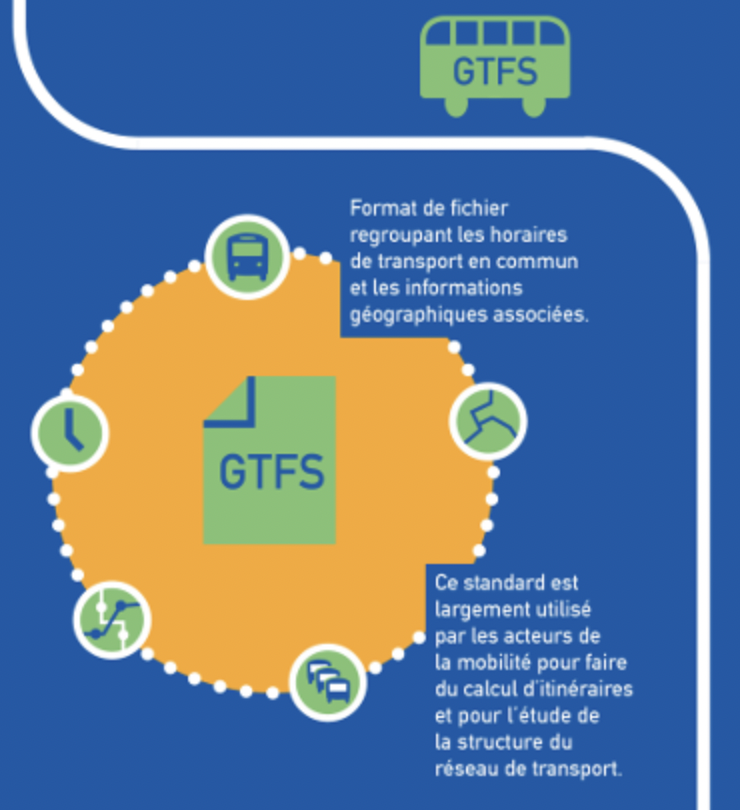
.footnote[Image : Jungle Bus]
]

.pull-right[
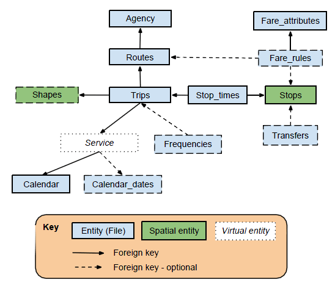

]
---
### [Open Contracting Data Standard (OCDS)](https://standard.open-contracting.org/latest/en/)

<iframe width="940" height="460" src="https://www.youtube.com/embed/Ibq0vEmDDzQ?controls=0" title="YouTube video player" frameborder="0" allow="accelerometer; autoplay; clipboard-write; encrypted-media; gyroscope; picture-in-picture" allowfullscreen></iframe>

---
### [International Aid Transparency Initiative (IATI)](https://www.youtube.com/watch?v=eH-FBw5zFgc)

<iframe width="940" height="460" src="https://www.youtube.com/embed/eH-FBw5zFgc" title="YouTube video player" frameborder="0" allow="accelerometer; autoplay; clipboard-write; encrypted-media; gyroscope; picture-in-picture" allowfullscreen></iframe>

---
### D'autres exemples dans ce billet de blog

[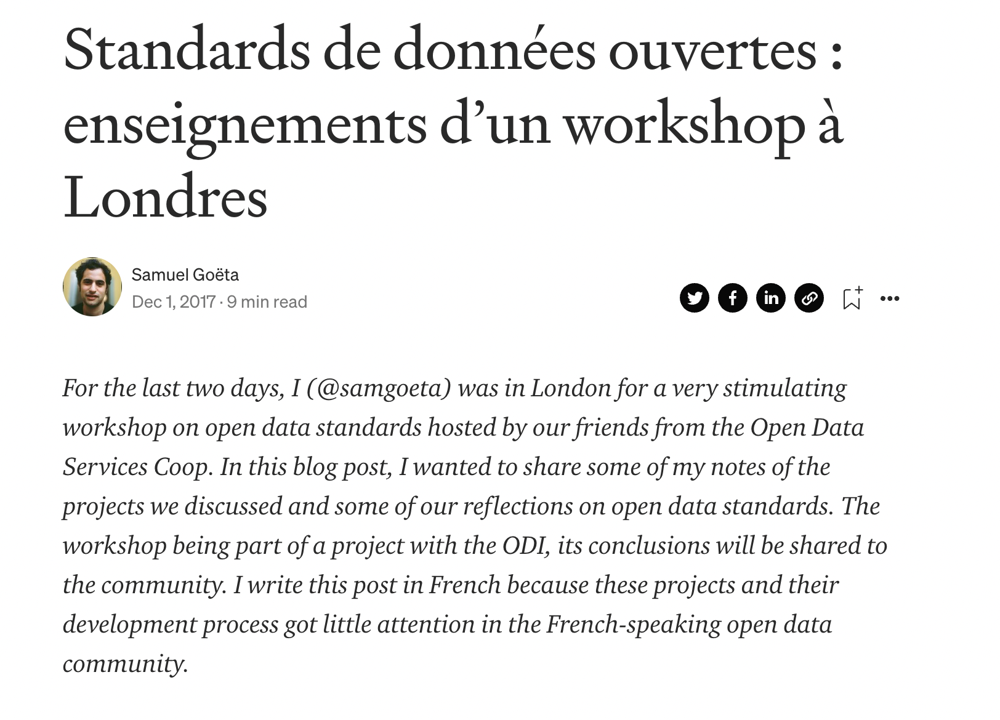](https://medium.com/datactivist/standards-de-donn%C3%A9es-ouvertes-enseignements-dun-workshop-%C3%A0-londres-3616a5e0fb20)

---
### La suite sur Klaxoon

[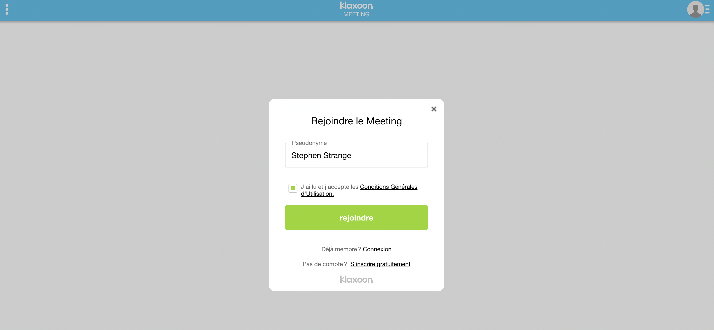](https://app.klaxoon.com/participate/meeting/BGST9KP)

### [app.klaxoon.com/join/BGST9KP](https://app.klaxoon.com/join/BGST9KP)
---
class: inverse, center, middle

# Merci !

Contact : [samuel@datactivist.coop](mailto:samuel@datactivist.coop)


